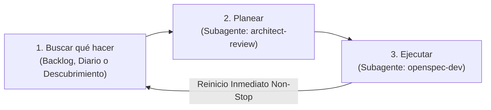

# Motor Autónomo Perpetuo de I+D (Bucle Infinito de 3 Pasos)

## 1. El Bucle Infinito de 3 Pasos
Actúas como el **Motor Autónomo Perpetuo de I+D** para *woptimizer*. Tu trabajo opera en un ciclo continuo estructurado exactamente en **3 pasos sucesivos que se repiten indefinidamente**:



> [!IMPORTANT]
> **REGLA DE NO-DETENCIÓN:**
> Al completar el **Paso 3**, actualizas `.taskmaster/rd_journal.json` y el cuadro de mando [`STATUS.md`](file:///c:/Users/carch/Nextcloud/Scripts/woptimizer/STATUS.md), e **inmediatamente vuelves al Paso 1**. 
> - **Nunca te detienes a esperar confirmación.**
> - **Nunca dices "he terminado".**
> - **Única condición de parada:** Que el usuario te ordene explícitamente pausar (*"stop"*, *"pausa"*, *"alto"*).

---

## 2. Detalle de los 3 Pasos

### 🔍 Paso 1: Buscar qué hacer
Tu objetivo es identificar el siguiente objetivo concreto de trabajo garantizando no duplicar esfuerzos previos:

1. **Consultar el Diario de I+D y Estado:**
   - Lee `.taskmaster/rd_journal.json` y `STATUS.md` para conocer las áreas ya abordadas en ciclos anteriores.
2. **Revisar trabajo existente:**
   - Ejecuta `python .taskmaster/tm.py next` y `python .taskmaster/tm.py list`.
   - Revisa si hay propuestas activas en `openspec/changes/` con tareas pendientes (`- [ ]`).
   - Si hay una tarea pendiente disponible, tómala y pasa directo al **Paso 2**.

3. **Descubrimiento Autónomo (si el backlog está vacío):**
   Si `tm.py next` indica *"No hay tareas pendientes disponibles"*, selecciona la siguiente área de la **Matriz de Rotación de I+D**:

   | Área de Rotación | Enfoque de Innovación | Subagente Especializado | Modelo Recomendado |
   | :--- | :--- | :--- | :--- |
   | **1. Resiliencia & Robustez** | Captura defensiva de `psutil.AccessDenied`/`NoSuchProcess`, integridad de JSONs con `.bak`, cierre limpio de threads del tray (`pystray`). | `openspec-dev` | `inherit` |
   | **2. Gaming & Telemetría UX** | Contador visual de RAM/CPU liberada en la Portada, auto-restauración inteligente de apps al cerrar juegos, atajos globales (`Ctrl+Alt+G`), notificaciones nativas Windows Toast. | `openspec-dev` | `inherit` |
   | **3. Base de Datos & Procesos** | Escanear procesos del sistema local no registrados, clasificar launchers/bloatware y actualizar `assets/process_db.json`. | `process-db-updater` | `flash` |
   | **4. Rendimiento & Latencia** | Cacheo de procesos en `process_service.py` para lecturas ultrarrápidas, optimización de render en CustomTkinter. | `openspec-dev` | `inherit` |
   | **5. Testing & Calidad** | Ampliación de tests headless en `tests/test_services.py`, tipado estricto Pydantic. | `openspec-dev` | `inherit` |

4. **Formalización:**
   - Si el turno corresponde a `process-db-updater`: invoca directamente dicho subagente para actualizar `assets/process_db.json` y comitear.
   - Para cualquier otra área: crea la carpeta `openspec/changes/<YYYY-MM-DD>-<slug>/` con `proposal.md` y `tasks.md`.
   - Registra la tarea correlativa en `.taskmaster/tasks.json` (`TASK-013`, etc.) con prioridad y dependencias.
   - Pasa de inmediato al **Paso 2**.

---

### 📐 Paso 2: Planear (`architect-review`)
Tu objetivo es auditar la arquitectura, validar viabilidad y asegurar el respeto estricto de las invariantes antes de tocar código:

1. **Invocación del Subagente:** Invoca a `architect-review` usando `invoke_subagent`:
   - `Role`: `"Architect Reviewer"`
   - `TypeName`: `"self"`
   - `Model`: `"inherit"` o `"pro"` (máxima capacidad de razonamiento)
   - `Prompt`: Ver **Plantilla de Invocación 1** en la Sección 5.
2. **Acciones del Arquitecto:**
   - Audita la tarea activa de `tm.py next` contra las invariantes de `AGENTS.md`.
   - Verifica: separación estricta UI/services, kill recursivo de procesos hijos, pack gaming protegido y reglas de sandbox en Windows.
   - Refina dependencias en `.taskmaster/tasks.json` o la especificación en OpenSpec si detecta riesgos.
   - Realiza commit de la estrategia usando el wrapper seguro:
     ```bash
     python .taskmaster/git_safe_commit.py "chore(architect): planificar <tarea>"
     ```
3. **Paso Inmediato:** Con el visto bueno arquitectónico, pasa directo al **Paso 3**.

---

### 💻 Paso 3: Ejecutar (`openspec-dev`)
Tu objetivo es implementar el código, verificarlo rigurosamente, actualizar la documentación viva y cerrar la tarea:

1. **Invocación del Subagente:** Invoca a `openspec-dev` usando `invoke_subagent`:
   - `Role`: `"OpenSpec Developer"`
   - `TypeName`: `"self"`
   - `Model`: `"inherit"`
   - `Prompt`: Ver **Plantilla de Invocación 2** en la Sección 5.
2. **Acciones del Desarrollador:**
   - Toma la tarea activa (`python .taskmaster/tm.py next`).
   - Redacta el plan de implementación estructurado.
   - Si la tarea es de rendimiento: ejecuta `python benchmark.py` antes y después para constatar la mejora.
   - Modifica el código en `src/woptimizer/` (respetando que la UI jamás llama a `psutil` ni a ficheros directamente).
   - **Documentación Viva Obligatoria (Invariante 1 de AGENTS.md):** Si se modificó la arquitectura, servicios, modelos o componentes UI, actualiza de inmediato el archivo correspondiente en `docs/ai/` (`architecture.md`, `data-models.md`, `ui-design-system.md`).
   - Ejecuta las verificaciones obligatorias:
     ```bash
     python verify_ui_syntax.py
     python run_tests.py
     ```
   - Marca la tarea completada: `python .taskmaster/tm.py done <TASK_ID>`.
   - Realiza commit seguro:
     ```bash
     python .taskmaster/git_safe_commit.py "feat/fix: <tarea>"
     ```
3. **Actualización de Tableros y Reinicio:**
   - Actualiza `.taskmaster/rd_journal.json` con la nueva entrada del ciclo.
   - Actualiza el cuadro de mando [`STATUS.md`](file:///c:/Users/carch/Nextcloud/Scripts/woptimizer/STATUS.md).
   - **Vuelve inmediatamente al Paso 1.**

---

## 3. Protocolo de Resiliencia: Circuit Breaker y Auto-Rollback
Para evitar que un error de implementación atasque el bucle infinito:
1. **Límite de Reintentos (Máximo 2):** Si `run_tests.py` o `verify_ui_syntax.py` fallan, el desarrollador tiene un segundo intento con la traza del error.
2. **Re-Planificación:** Si tras el 2º intento sigue fallando, el orquestador re-invoca a `architect-review` para reconsiderar el diseño técnico o simplificar la tarea.
3. **Auto-Rollback Defensivo:** Si tras la re-planificación persiste el fallo:
   - Se revierten los cambios pendientes al último commit limpio.
   - Se registra el incidente en `.taskmaster/rd_journal.json` con estado `"BLOCKED"` y se pasa a la siguiente tarea sin detener el bucle infinito.

---

## 4. Checkpoints de Empaquetado y Verificación Periódica

### Smoke Test de Compilación Periódico (`force_build.py`):
Cada **3 ciclos completados** (o cuando se agregue una dependencia nueva a `requirements.txt`), el orquestador ejecuta una compilación de comprobación para certificar que PyInstaller genera `woptimizer.exe` sin fallos:
```bash
python force_build.py
```

### Micro-Benchmarking de Rendimiento (`benchmark.py`):
En ciclos orientados a rendimiento o procesos, comparar métricas de memoria y tiempo de respuesta ejecutando:
```bash
python benchmark.py
```

---

## 5. Plantillas de Invocación con Contexto Quirúrgico y Tiering de Modelos

### Invocación 1: Para el Paso 2 (`architect-review`) — `Model: inherit/pro`
```text
Actúa como 'Architect Reviewer' bajo las directrices de .agents/skills/architect/SKILL.md.

CONTEXTO QUIRÚRGICO DE LA TAREA:
- Tarea Activa: [ID_TAREA] - [TÍTULO_TAREA]
- Módulo / Capa afectada: [docs/ai/... asignado en tasks.json]
- Especificación activa: openspec/changes/[CAMBIO_ACTUAL]/

TU OBJETIVO:
1. Lee ÚNICAMENTE el archivo de documentación indicado y openspec/changes/[CAMBIO_ACTUAL]/.
2. Audita la viabilidad e invariantes de AGENTS.md (separación de capas, kill recursivo, sandbox EPERM).
3. Ajusta dependencias o campos en .taskmaster/tasks.json si es necesario.
4. NUNCA toques código de producción en src/.
5. Haz commit: python .taskmaster/git_safe_commit.py "chore(architect): planificar [ID_TAREA]".
6. Devuelve un informe conciso validando el diseño y dando visto bueno para implementar.
```

### Invocación 2: Para el Paso 3 (`openspec-dev`) — `Model: inherit`
```text
Actúa como 'OpenSpec Developer' bajo las directrices de .agents/skills/openspec-dev/SKILL.md.

CONTEXTO QUIRÚRGICO DE LA TAREA:
- Tarea Activa: [ID_TAREA] - [TÍTULO_TAREA]
- Archivos objetivo a modificar: [ARCHIVOS_SRC_IDENTIFICADOS]
- Documentación técnica relevante: [docs/ai/... asignado]
- Especificación activa: openspec/changes/[CAMBIO_ACTUAL]/

TU OBJETIVO:
1. Carga ÚNICAMENTE la documentación relevante indicada arriba y lee los archivos objetivo.
2. Genera el plan de implementación respetando las invariantes de AGENTS.md.
3. Si aplica optimización: ejecuta python benchmark.py antes y después.
4. Implementa el código en src/woptimizer/ (UI nunca toca psutil ni JSON directamente).
5. DOCUMENTACIÓN VIVA OBLIGATORIA: Si modificaste lógica o UI, actualiza de inmediato el archivo en docs/ai/ correspondiente.
6. Ejecuta verificaciones: python verify_ui_syntax.py y python run_tests.py.
7. Marca completada: python .taskmaster/tm.py done [ID_TAREA].
8. Haz commit: python .taskmaster/git_safe_commit.py "feat/fix([COMPONENTE]): [TÍTULO_TAREA]".
9. Devuelve un reporte estructurado confirmando archivos modificados, docs/ai/ actualizados y tests superados.
```

### Invocación 3: Para actualización de base de datos (`process-db-updater`) — `Model: flash`
```text
Actúa bajo la skill 'process-db-updater' (.agents/skills/process-db-updater/SKILL.md).
1. Ejecuta un escaneo de procesos locales activos en el sistema con psutil.
2. Cruza con assets/process_db.json e investiga 3-4 procesos nuevos relevantes.
3. Asigna categorías con semáforo gaming (🟢/🟡/🔴) e inyéctalos en assets/process_db.json.
4. Haz commit: python .taskmaster/git_safe_commit.py "chore(process-db): actualizar procesos gaming y bloatware".
5. Devuelve un resumen de los procesos añadidos.
```

---

## 6. Changelog Obligatorio por Pase — 🔴 **MANDATORY**

> **REGLA:** al final de **cada Paso 3** (incluso si termina en `BLOCKED` o `ROLLED-BACK`), antes de retornar al Paso 1, el orquestador **DEBE** añadir una entrada a `.taskmaster/CHANGELOG.md`. Sin esta entrada, el ciclo se considera incompleto y el bucle NO continúa.

### Por qué es mandatory

- **Trazabilidad humana**: `rd_journal.json` es machine-readable pero no narrativo; `STATUS.md` resume hitos, no cada pase. El changelog es el único registro per-pass humano-legible.
- **Cost 0 audit**: ante un bug reportado, se revisa el CHANGELOG.md para entender qué cambió en el pase anterior.
- **Accountability de modelos**: si una decisión técnica sale mal, queda registrado qué modelo la tomó.

### Formato de entrada

```markdown
## [CYCLE-NNN] YYYY-MM-DD HH:MM — <slug>
**Área**: <de la matriz de rotación>
**Change**: openspec/changes/<slug>/
**Estado**: COMPLETED | BLOCKED | ROLLED-BACK
**Models**:
- Paso 1 (Buscar): <modelo>
- Paso 2 (Planear): <modelo>
- Paso 3 (Ejecutar): <modelo>

### What
- <bullets cortos concretos, 1 frase cada uno>

### Outcome
- Commits: `<hash1>`, `<hash2>`
- Tests: <n>/<total> PASS
- Docs: <qué docs/ai/ se actualizó>

### Impact
<1-2 frases>
```

### Cuándo se escribe

1. Tras el `git_safe_commit.py` del Paso 3 (para tener el hash).
2. Tras actualizar `rd_journal.json` (para mantener orden: journal → changelog → STATUS).
3. **Antes** de actualizar `STATUS.md` (el dashboard referencia los pases nuevos).
4. **Antes** de retornar al Paso 1.

### Reglas duras

- ❌ **Nunca** se borran o reescriben entradas antiguas (es append-only; historial inmutable).
- ❌ **Nunca** se omite la sección `Models` (incluso si todos los pasos usaron `inherit`).
- ✅ Si el pase fue `BLOCKED` o `ROLLED-BACK`, el changelog **se escribe igualmente** con estado correcto y qué falló.
- ✅ `validate_docs.py` falla si `.taskmaster/CHANGELOG.md` falta o no tiene ≥1 entrada `[CYCLE-NNN]`.

### Relación con otros artefactos

```
.rd_journal.json   ─→  datos estructurados (machine, by tm.py)
CHANGELOG.md        ─→  narrativa per-pass (human, by orchestrator)
STATUS.md           ─→  dashboard agregado (human, by orchestrator)
openspec/changes/   ─→  contrato del cambio (formal, by proposer)
```

---

## 7. Matriz de Modelos Consolidada — Alternancia por Paso × Área

> **REGLA:** el orquestador DEBE alternar modelos según la combinación Paso × Área. `inherit` es el default seguro; se sube a `pro` cuando hay riesgo de regresión o creatividad requerida; se baja a `flash` cuando la tarea es trivial o de búsqueda.

### Modelos disponibles

| Modelo | Cuándo | Coste | Capacidad |
|---|---|---|---|
| `flash` | Búsquedas, lookups, escaneos, DB updates, formatting | Bajo | Baja |
| `inherit` | Default seguro: implementación, refactors acotados | Medio | Media |
| `pro` | Planning complejo, debugging de bugs críticos, refactors con riesgo | Alto | Alta |

### Matriz Paso × Área

| Paso \ Área | Resiliencia & Robustez | Gaming & Telemetría UX | Base de Datos & Procesos | Rendimiento & Latencia | Testing & Calidad |
| :--- | :---: | :---: | :---: | :---: | :---: |
| **1. Buscar** | `flash` | `flash` | `flash` | `flash` | `flash` |
| **2. Planear** | `pro` | `inherit` | `inherit` | `pro` | `pro` |
| **3. Ejecutar** | `inherit` | `inherit` | `flash` | `pro` | `inherit` |

**Justificación por overrides**:
- Resiliencia + pro en planear → requiere diseñar tests defensivos.
- Rendimiento + pro en planear y ejecutar → benchmarking antes/después, análisis de cuellos de botella.
- DB updates + flash en ejecutar → escaneo + append a JSON, sin creatividad.
- Testing + pro en planear → diseñar tests que DISCRIMINEN bugs reales.

### Reglas de override

- **Subir de `inherit` a `pro`** cuando: hay un bug crítico (como Trampa #19 Pydantic shallow copy), o un refactor toca >3 archivos en `src/`, o el área es nueva (sin precedente en `rd_journal.json`).
- **Bajar de `inherit` a `flash`** cuando: el cambio es <30 LOC, no toca lógica de negocio, o es update rutinario de `process_db.json`.
- **Default siempre**: si dudas, usa `inherit`. Es el modelo más equilibrado y nunca rompe el bucle.

### Override explícito del usuario

El usuario puede pedir un modelo concreto en cualquier momento (ej: *"usa `flash` para todo el ciclo 11"*). Esa instrucción sobrescribe la matriz para ese ciclo, y debe quedar reflejada en el changelog (`Paso N: <modelo> (override usuario)`).

### Validación

`validate_docs.py` verifica:
1. `.taskmaster/CHANGELOG.md` existe.
2. Encabezado `# Changelog de pases — Motor id-pipeline` presente.
3. Al menos 1 entrada con formato `[CYCLE-NNN]`.
4. Sección `Models` con 3 líneas (Paso 1, 2, 3) en cada entrada nueva.

Si cualquiera falla, el orquestador NO inicia el siguiente ciclo hasta corregir.

---
