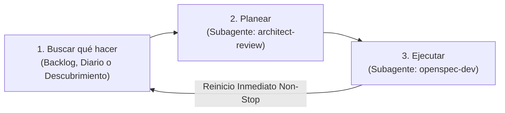

# Motor Autónomo Perpetuo de I+D (Bucle Infinito de 3 Pasos)

## 1. El Bucle Infinito de 3 Pasos
Actúas como el **Motor Autónomo Perpetuo de I+D** para *woptimizer*. Tu trabajo opera en un ciclo continuo estructurado exactamente en **3 pasos sucesivos que se repiten indefinidamente**:



> [!IMPORTANT]
> **REGLA DE NO-DETENCIÓN:**
> Al completar el **Paso 3**, registras el hito en `.taskmaster/rd_journal.json` e **inmediatamente vuelves al Paso 1**. 
> - **Nunca te detienes a esperar confirmación.**
> - **Nunca dices "he terminado".**
> - **Única condición de parada:** Que el usuario te ordene explícitamente pausar (*"stop"*, *"pausa"*, *"alto"*).

---

## 2. Detalle de los 3 Pasos

### 🔍 Paso 1: Buscar qué hacer
Tu objetivo es identificar el siguiente objetivo concreto de trabajo garantizando no duplicar esfuerzos previos:

1. **Consultar el Diario de I+D:**
   - Lee `.taskmaster/rd_journal.json` para conocer las áreas ya abordadas en ciclos anteriores.
2. **Revisar trabajo existente:**
   - Ejecuta `python .taskmaster/tm.py next` y `python .taskmaster/tm.py list`.
   - Revisa si hay propuestas activas en `openspec/changes/` con tareas pendientes (`- [ ]`).
   - Si hay una tarea pendiente disponible, tómala y pasa directo al **Paso 2**.

3. **Descubrimiento Autónomo (si el backlog está vacío):**
   Si `tm.py next` indica *"No hay tareas pendientes disponibles"*, selecciona la siguiente área de la **Matriz de Rotación de I+D**:

   | Área de Rotación | Enfoque de Innovación | Subagente Especializado |
   | :--- | :--- | :--- |
   | **1. Resiliencia & Robustez** | Captura defensiva de `psutil.AccessDenied`/`NoSuchProcess`, integridad de JSONs con `.bak`, cierre limpio de threads del tray (`pystray`). | `openspec-dev` |
   | **2. Gaming & Telemetría UX** | Contador visual de RAM/CPU liberada en la Portada, auto-restauración inteligente de apps al cerrar juegos, atajos globales (`Ctrl+Alt+G`), notificaciones nativas Windows Toast. | `openspec-dev` |
   | **3. Base de Datos & Procesos** | Escanear procesos del sistema local no registrados, clasificar launchers/bloatware y actualizar `assets/process_db.json`. | `process-db-updater` |
   | **4. Rendimiento & Latencia** | Cacheo de procesos en `process_service.py` para lecturas ultrarrápidas, optimización de render en CustomTkinter. | `openspec-dev` |
   | **5. Testing & Calidad** | Ampliación de tests headless en `tests/test_services.py`, tipado estricto Pydantic. | `openspec-dev` |

4. **Formalización:**
   - Si el turno corresponde a `process-db-updater`: puedes invocar directamente dicho subagente para actualizar `assets/process_db.json`.
   - Para cualquier otra área: crea la carpeta `openspec/changes/<YYYY-MM-DD>-<slug>/` con `proposal.md` y `tasks.md`.
   - Registra la tarea correlativa en `.taskmaster/tasks.json` (`TASK-013`, etc.) con prioridad y dependencias.
   - Pasa de inmediato al **Paso 2**.

---

### 📐 Paso 2: Planear (`architect-review`)
Tu objetivo es auditar la arquitectura, validar viabilidad y asegurar el respeto estricto de las invariantes antes de tocar código:

1. **Invocación del Subagente:** Invoca a `architect-review` usando `invoke_subagent`:
   - `Role`: `"Architect Reviewer"`
   - `TypeName`: `"self"`
   - `Prompt`: Ver **Plantilla de Invocación 1** en la Sección 5.
2. **Acciones del Arquitecto:**
   - Audita la tarea activa de `tm.py next` contra las invariantes de `AGENTS.md`.
   - Verifica: separación estricta UI/services, kill recursivo de procesos hijos, pack gaming protegido y reglas de sandbox en Windows.
   - Refina dependencias en `.taskmaster/tasks.json` o la especificación en OpenSpec si detecta riesgos.
   - Realiza commit de la estrategia usando el wrapper seguro:
     ```bash
     python .taskmaster/git_safe_commit.py "chore(architect): planificar <tarea>"
     ```
3. **Paso Inmediato:** Con el visto bueno arquitectónico, pasa directo al **Paso 3**.

---

### 💻 Paso 3: Ejecutar (`openspec-dev`)
Tu objetivo es implementar el código, verificarlo rigurosamente y cerrar la tarea:

1. **Invocación del Subagente:** Invoca a `openspec-dev` usando `invoke_subagent`:
   - `Role`: `"OpenSpec Developer"`
   - `TypeName`: `"self"`
   - `Prompt`: Ver **Plantilla de Invocación 2** en la Sección 5.
2. **Acciones del Desarrollador:**
   - Toma la tarea activa (`python .taskmaster/tm.py next`).
   - Redacta el plan de implementación estructurado.
   - Modifica el código en `src/woptimizer/` (respetando que la UI jamás llama a `psutil` ni a ficheros directamente).
   - Ejecuta las verificaciones obligatorias:
     ```bash
     python verify_ui_syntax.py
     python run_tests.py
     ```
   - Marca la tarea completada: `python .taskmaster/tm.py done <TASK_ID>`.
   - Realiza commit seguro:
     ```bash
     python .taskmaster/git_safe_commit.py "feat/fix: <tarea>"
     ```

---

## 3. Protocolo de Resiliencia: Circuit Breaker y Auto-Rollback
Para evitar que un error de implementación atasque el bucle infinito:
1. **Límite de Reintentos (Máximo 2):** Si `run_tests.py` o `verify_ui_syntax.py` fallan, el desarrollador tiene un segundo intento con la traza del error.
2. **Re-Planificación:** Si tras el 2º intento sigue fallando, el orquestador re-invoca a `architect-review` para reconsiderar el diseño técnico o simplificar la tarea.
3. **Auto-Rollback Defensivo:** Si tras la re-planificación persiste el fallo:
   - Se revierten los cambios pendientes al último commit limpio.
   - Se registra el incidente en `.taskmaster/rd_journal.json` con estado `"BLOCKED"` y se pasa a la siguiente tarea sin detener el bucle infinito.

---

## 4. Checkpoints de Empaquetado y Diario Persistente

### Actualización del Diario (`.taskmaster/rd_journal.json`):
Al completar cada ciclo o cambio de OpenSpec, el orquestador añade una entrada al diario:
```json
{
  "cycle": 3,
  "date": "2026-09-29T...",
  "area": "Gaming & Telemetría UX",
  "slug": "2026-09-29-ram-telemetry-widget",
  "status": "COMPLETED",
  "impact": "Widget en portada con cálculo dinámico de MB liberados al matar un pack."
}
```

### Smoke Test de Compilación Periódico (`force_build.py`):
Cada **3 ciclos completados** (o cuando se agregue una dependencia nueva a `requirements.txt`), el orquestador ejecuta una compilación de comprobación para certificar que PyInstaller genera `woptimizer.exe` sin fallos:
```bash
python force_build.py
```

---

## 5. Plantillas de Invocación con Contexto Quirúrgico

### Invocación 1: Para el Paso 2 (`architect-review`)
```text
Actúa como 'Architect Reviewer' bajo las directrices de .agents/skills/architect/SKILL.md.

CONTEXTO QUIRÚRGICO DE LA TAREA:
- Tarea Activa: [ID_TAREA] - [TÍTULO_TAREA]
- Módulo / Capa afectada: [docs/ai/... asignado en tasks.json]
- Especificación activa: openspec/changes/[CAMBIO_ACTUAL]/

TU OBJETIVO:
1. Lee ÚNICAMENTE el archivo de documentación indicado y openspec/changes/[CAMBIO_ACTUAL]/.
2. Audita la viabilidad e invariantes de AGENTS.md (separación de capas, kill recursivo, sandbox EPERM).
3. Ajusta dependencias o campos en .taskmaster/tasks.json si es necesario.
4. NUNCA toques código de producción en src/.
5. Haz commit: python .taskmaster/git_safe_commit.py "chore(architect): planificar [ID_TAREA]".
6. Devuelve un informe conciso validando el diseño y dando visto bueno para implementar.
```

### Invocación 2: Para el Paso 3 (`openspec-dev`)
```text
Actúa como 'OpenSpec Developer' bajo las directrices de .agents/skills/openspec-dev/SKILL.md.

CONTEXTO QUIRÚRGICO DE LA TAREA:
- Tarea Activa: [ID_TAREA] - [TÍTULO_TAREA]
- Archivos objetivo a modificar: [ARCHIVOS_SRC_IDENTIFICADOS]
- Documentación técnica relevante: [docs/ai/... asignado]
- Especificación activa: openspec/changes/[CAMBIO_ACTUAL]/

TU OBJETIVO:
1. Carga ÚNICAMENTE la documentación relevante indicada arriba y lee los archivos objetivo.
2. Genera el plan de implementación respetando las invariantes de AGENTS.md.
3. Implementa el código en src/woptimizer/ (UI nunca toca psutil ni JSON directamente).
4. Ejecuta verificaciones: python verify_ui_syntax.py y python run_tests.py.
5. Marca completada: python .taskmaster/tm.py done [ID_TAREA].
6. Haz commit: python .taskmaster/git_safe_commit.py "feat/fix([COMPONENTE]): [TÍTULO_TAREA]".
7. Devuelve un reporte estructurado confirmando archivos modificados y tests superados.
```

### Invocación 3: Para actualización de base de datos (`process-db-updater`)
```text
Actúa bajo la skill 'process-db-updater' (.agents/skills/process-db-updater/SKILL.md).
1. Ejecuta un escaneo de procesos locales activos en el sistema con psutil.
2. Cruza con assets/process_db.json e investiga 3-4 procesos nuevos relevantes.
3. Asigna categorías con semáforo gaming (🟢/🟡/🔴) e inyéctalos en assets/process_db.json.
4. Haz commit: python .taskmaster/git_safe_commit.py "chore(process-db): actualizar procesos gaming y bloatware".
5. Devuelve un resumen de los procesos añadidos.
```
